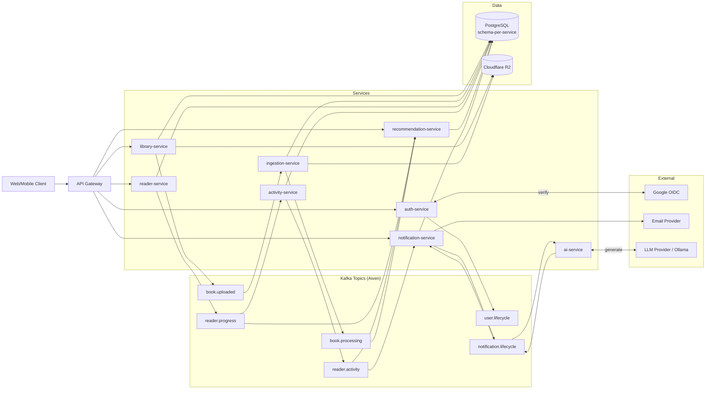

# Humanize Architecture Flow Diagram

## Event Path (Spoiler Notification)

`reader-service -> reader.progress -> activity-service -> reader.activity -> notification-service -> notification.lifecycle(SPOILER_REQUESTED) -> ai-service -> notification.lifecycle(SPOILER_GENERATED) -> notification-service -> email provider`

